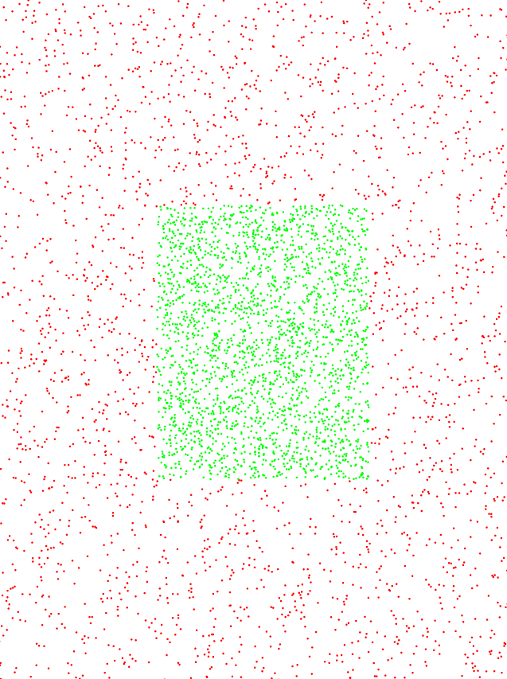

# Deep Learning

This 2 mini projects are made with the objective of understand the basics of machine learning.

### Compile with 
```
cd ObjectMethod
make
cd ../TabMethod
make
```


# TAB METHOD
The graph generated by this program is the neural network with all the data in the current learning moment
 
```
Observation

This method only use tables for represent the neurons and layers, the results is the same of the other method but the code are less readable.
```
# Object Method
The graph generated by this program is the current map with all the points with a color code, red is for "out the square" and green for "in the square".

This method have save files which save the current state of the learning process, its allow to stop and re-run the programm without lose.

<p align="center">

</p>

```
Observation

The object method is more organized and that make it more easy for understand, learn and improve the code.
```

# Machine Learning specifications

## Activation function
The activation function is the function that is going to take the result of the linear function (somme of the weight and byas) and apply a modification like a relu function or a sigmoid, in this case for all the neurons the function is a sigmoid.

## Cost function
The cost function will determine the result of the neuron

## Backpropagation algorithm
Applying the gradient descent to all the neurons from the last layers to the first one will correct the error for each neuron according to its involvement.

### Math context

Z = the somme of the variables and byas of each neuron($Z^n$ the somme of the layer n) \
A = the activation function which is this case the sigmoid function($A^n$ the function applyed to the layer n) \
C = cost function($C^n$ the function appyed to the layer n) \
$w^n$ = weight of layer n \
$b^n$ = byas of layer n \
$\delta^n$ = error of the layer n


For do that its needed to apply these partial derivatives:

$$ \frac{\partial C}{\partial w^L} \ \ and \ \ 
\frac{\partial C}{\partial b^L}$$

The derivative of the cost fuction by all the neuron inputs (weight and byas).

$$\frac{\partial C}{\partial w^L} = 
\frac{\partial C}{\partial A^L} * \frac{\partial A^L}{\partial Z^L} * \frac{\partial Z^L}{\partial w^L}$$

$$\frac{\partial C}{\partial b^L} = 
\frac{\partial C}{\partial A^L} * \frac{\partial A^L}{\partial Z^L} * \frac{\partial Z^L}{\partial b^L}$$

### Last layer

$$\frac{\partial Z^L}{\partial b^L} = 1 \ \ \
\frac{\partial Z^L}{\partial w^L} = Y^{L-1} \ \ \
\frac{\partial C}{\partial A^L}*\frac{\partial A^L}{\partial Z^L} = \delta^L$$

$\frac{\partial C}{\partial A^L}$ = derivative of the cost function 

$\frac{\partial A^L}{\partial Z^L}$ = derivative of the activation function 

The equation for last layer is now like this:

$$\frac{\partial C}{\partial w^L} = 
\delta^LY^{L-1}$$

$$\frac{\partial C}{\partial b^L} = 
\delta^L$$

### Propagation
$$\delta^L = \frac{\partial C}{\partial A^L}*\frac{\partial A^L}{\partial Z^L}$$

$$\delta^{L-1} = w^L\delta^L*\frac{\partial A^{L-1}}{\partial Z^{L-1}}$$

$$\frac{\partial C}{\partial b^{L-1}} = \delta^{L-1} \ \ \frac{\partial C}{\partial w^{L-1}} = \delta^{L-1}*Y^{L-2}$$
